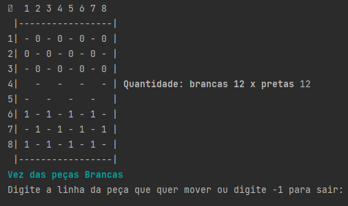

<h1 align ="center"> ♟️Jogo de Damas♟️</h1>

  Este é um jogo desenvolvido por mim (Rafael) e por <a href ="https://github.com/PHFelipe/">Paulo Henrique</a>, Idealizado e acompanhado na disciplina de Algoritmos e programação do curso de Engenharia da Computação IFPB-CG.

  

  
## 🖥️ Desenvolvimento
O projeto foi desenvolvido em Python 3.1 e sua apresentação ocorre totalmente em interface de comando.

## 🎮 Sobre o jogo
O jogo possui um tabuleiro 8x8 o qual o usuário movimenta peças com o intuito de captura-las até obter o maximo de peças do seu oponente, ou seja, fazer com que seu oponente tenha 0 peças sem que ele faça o mesmo com voce.

Não são observados movimentos de captura múltipla(capturar varias peças ao mesmo tempo), transformação de dama (direitos de movimentação completa nas diagonais) e condições de empate.

É necessário que possua 2 jogadores para concluir os movimentos, visto que, o jogo nao possui nenhuma automação para propiciar um duelo humano vs computador.
